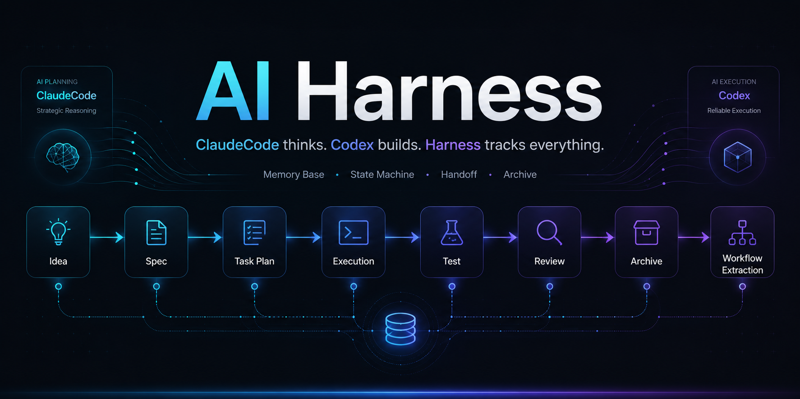

<p align="center">
  <strong><a href="#english">English</a></strong>
  &nbsp;|&nbsp;
  <strong><a href="#chinese">简体中文</a></strong>
</p>

---

<p align="center">
  
</p>

<p align="center">
  <a href="https://github.com/ietigerjue/awesome-agent-memorybase/blob/master/CHANGELOG.md"></a>
  &nbsp;
  <a href="LICENSE"></a>
</p>

<p align="center">
  A memory-base execution control system for ClaudeCode + Codex dual-agent collaboration.<br>
  From idea to archive — every decision logged, every handoff clean, every project traceable.<br>
  <strong>v2.0</strong>: Knowledge Base auto-classification · 5-section Handoff · Session-Log · Loop System · Darwin Ratchet.
</p>

---

<span id="english"></span>

## English

### What It Is

Awesome Agent MemoryBase is a **memory-based execution control system** that turns ClaudeCode (thinking/executing) and Codex (reviewing/testing) into a traceable, recoverable, reusable engineering pipeline.

### What Problem It Solves

| Without Harness | With Harness |
|---|---|
| Agent forgets where it left off | Session-log + project record track every state |
| Handoff is chaotic, context lost | 5-section Handoff protocol with file whitelist + context kit + review dimensions |
| Completed project knowledge evaporates | Archive summary + workflow extraction + knowledge base compilation |
| Knowledge scattered across chats | Knowledge Base with domain-based auto-classification + global index |
| No quality gate before shipping | Done Criteria checklist + Codex adversarial review before archive |

### Architecture (v2.0)

```
Memory Base/
├── 00_总索引/          Rules, Skill Index, Agent roles
├── 01_项目记录/        Projects (webapp/app/skills/media/other)
├── 02_工作流沉淀/      Reusable workflows by domain
├── 03_Skill产物/       Skill outputs
├── 04_归档项目/        Completed projects with summaries
├── 06_评估与优化/      Agent quality evaluation
├── 07_模板库/          Standardized templates
├── 08_知识库/          Knowledge Base with auto-classification
└── memory/             Session-logs, preferences, rules
```

### Agent Division (v2.0)

| ClaudeCode | Codex |
|---|---|
| Brainstorm, design, plan | Code review, find bugs, fix bugs |
| Write code, modify files, debug | Independent testing, security audit |
| Project archive, workflow extraction | Done Criteria verification |
| Knowledge base ingestion & maintenance | File migration verification |
| Generate Codex review instructions | Adversarial review of ClaudeCode output |

**Core principle**: ClaudeCode owns "what to think, how to do." Codex owns "is it done right, are there bugs." Maker and checker must be separate.

### Codex Handoff Protocol (5-Section Mandatory)

| # | Section | Content |
|---|---|---|
| 1 | File Whitelist | `git diff --name-only`. Codex MUST NOT explore beyond. |
| 2 | Context Kit | Change summary + callgraph + test status + known risks |
| 3 | Review Dimensions | correctness / security / race / business logic ONLY |
| 4 | Sub-agent Cap | Default = 3. Exceeding needs justification. |
| 5 | Output Format | Brief + detailed analysis to project record |

### Simple Task Bypass

Skip Codex review when: 1 file + 50 lines + no new imports. OR pure docs/config. EXCEPT: auth/encryption/DB/payment/eval/exec/secrets/CI.

### Knowledge Base System (v2.0)

Domain-based auto-classification:

```
08_知识库/
├── SCHEMA.md           LLM operation protocol
├── index.md            Global index by domain
├── log.md              Append-only operation log
├── 01_技术/            Tech: AI/LLM, languages, tools
├── 02_科研/            Research by field
├── 03_创意方法论/       Creative methods
├── 04_工作方法/        Work methods
├── 05_产品与商业/      Product ideas, business
└── 06_技术参考/        Architecture specs, references
```

**Ingest workflow** (two-step CoT): Analyze (domain, entities, concepts, claims) → Generate (pages, index, log). Auto-classification via decision tree in `SCHEMA.md`. Quality: plain language + analogies + exhaustive extraction + contradiction marking.

### Session-Log System

Every code change logged to `memory/session-log-YYYY-MM-DD.md`. ClaudeCode block (what changed) + Codex block (review findings). Facts only.

### Loop System + Darwin Ratchet

Recurring autonomous tasks via `/loop`. Audit loop: 6 health signals. Every harness file follows Darwin Ratchet: each modification must improve or stay equal, never degrade.

### Project Record Categories

```
01_项目记录/
├── webapp/    Web applications
├── app/       Desktop/mobile apps
├── skills/    Skill development
├── 自媒体/    Social media
└── 其他/     Other
```

### Quick Start

```bash
git clone https://github.com/ietigerjue/awesome-agent-memorybase.git
cd awesome-agent-memorybase && bash install.sh --all
```

```
初始化记忆库
新建项目 MyProject
帮我把这篇内容添加入知识库
```

### License · MIT

---

<span id="chinese"></span>

## 简体中文

### 这是什么

Awesome Agent MemoryBase 是一套**基于记忆库的双 Agent 执行控制系统**，让 ClaudeCode（思考+执行）和 Codex（审查+测试）的协作变成可追溯、可回滚、可复用的工程管线。

### 解决了什么问题

| 没有 Harness | 有了 Harness |
|---|---|
| Agent 忘记上次做到哪了 | Session-log + 项目记录追踪每个状态 |
| Handoff 混乱，上下文丢失 | 五段 Handoff 协议：白名单 + Context Kit + 审查维度 + Sub-agent 上限 + 输出格式 |
| 完成的项目经验丢失 | 归档总结 + 工作流沉淀 + 知识库编译 |
| 知识散落在各次聊天中 | 知识库按域自动归类 + 全局索引 |
| 发布前无质量关卡 | Done Criteria 检查 + Codex 对抗审查 |

### 架构 (v2.0)

```
Memory Base/
├── 00_总索引/          规则、Skill 索引、Agent 分工
├── 01_项目记录/        项目 (webapp/app/skills/自媒体/其他)
├── 02_工作流沉淀/      按领域沉淀可复用工作流
├── 03_Skill产物/       Skill 输出文件
├── 04_归档项目/        已完成项目含总结
├── 06_评估与优化/      Agent 执行质量评估
├── 07_模板库/          标准化模板
├── 08_知识库/          知识库（自动归类 + 全局索引）
└── memory/             Session-log、偏好、规则
```

### Agent 分工 (v2.0)

| ClaudeCode | Codex |
|---|---|
| 脑暴 / 方案 / 计划 | 代码审查 / 找 bug / 修 bug |
| 写代码 / 改文件 / 调试 | 独立测试 / 安全审计 |
| 项目归档 / 工作流沉淀 | Done Criteria 校验 |
| 知识库摄取与维护 | 文件迁移完整性验证 |
| 生成 Codex 审查指令 | 对抗性审查 ClaudeCode 产出 |

**核心原则**: ClaudeCode 管"想什么、怎么做"，Codex 管"做得对不对、有没有 bug"。Maker 和 Checker 必须分离。

### Codex Handoff 协议（五段强制）

| # | 段 | 内容 |
|---|---|---|
| 1 | 可读文件白名单 | `git diff --name-only`。禁止 Codex grep/find/ls 越界探索。 |
| 2 | Context Kit | 改动摘要 + callgraph + 测试状态 + 已知风险 |
| 3 | 审查维度 | 只看 correctness / security / race / 业务逻辑。不看风格。 |
| 4 | Sub-agent 上限 | 默认 = 3。超过必须写理由。 |
| 5 | 输出格式 | 简报 + 详细分析到项目记录 |

### 简单任务跳过 Codex

满足任一即可跳过：1 文件且 50 行且无新 import / 纯文档 / 纯配置。但鉴权/加密/DB migration/支付/CI 永远不能跳过。

### 知识库系统 (v2.0)

按**知识域**自动归类：

```
08_知识库/
├── SCHEMA.md           LLM 操作协议
├── index.md            按知识域分组全局索引
├── log.md              追加式操作日志
├── 01_技术/            AI/LLM、编程语言、工具框架
├── 02_科研/            按学科领域
├── 03_创意方法论/       创意方法
├── 04_工作方法/         内容创作、效率方法
├── 05_产品与商业/       产品想法、商业分析
└── 06_技术参考/         架构规格、参考实现
```

**摄取工作流**（两步思维链）: 分析（提取域/实体/概念/主张）→ 生成（写页面/更新索引/记录日志）。`SCHEMA.md` 含自动归类决策树。质量规则: 白话+类比（易懂），穷尽提取+保留出处+矛盾标注（不丢失关键知识点）。

### Session-Log 系统

每次改动立即记入 `memory/session-log-YYYY-MM-DD.md`。ClaudeCode 块 + Codex 块。只记事实。

### Loop 系统 + Darwin Ratchet

`/loop` 定时自主任务。Audit loop: 6 项健康信号。每个文件遵循 Darwin Ratchet: 每次修改必须更好或等价，禁止劣化。

### 项目记录分类

```
01_项目记录/
├── webapp/    网页应用
├── app/       桌面/移动应用
├── skills/    Skill 开发
├── 自媒体/    自媒体运营
└── 其他/     其他项目
```

### 快速开始

```bash
git clone https://github.com/ietigerjue/awesome-agent-memorybase.git
cd awesome-agent-memorybase && bash install.sh --all
```

```
初始化记忆库
新建项目 MyProject
帮我把这篇内容添加入知识库
```

### License · MIT
