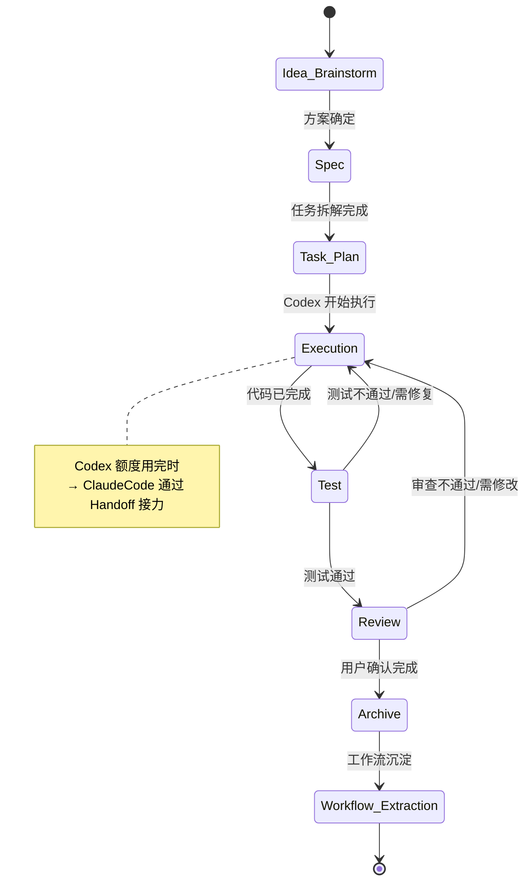

# 项目状态机规则

> **版本**: v1.0 | **创建日期**: 2026-06-10 | **执行 Agent**: ClaudeCode

---

## 1. 状态机总览



---

## 2. 各状态详细说明

### 2.1 Idea / Brainstorm（想法/脑暴）

| 属性 | 说明 |
|---|---|
| **状态定义** | 用户提出想法，ClaudeCode 与用户讨论、分析、完善方案 |
| **进入条件** | 用户提出新想法或需求 |
| **退出条件** | 方案方向已明确，可以进入方案设计 |
| **负责 Agent** | ClaudeCode |
| **必须更新的文件** | 项目记录文件（基本信息 + 目标） |
| **禁止事项** | 不能直接开始写代码；不能跳过方案设计阶段 |

### 2.2 Spec（方案设计）

| 属性 | 说明 |
|---|---|
| **状态定义** | 将讨论结果转化为可执行的技术方案和产品方案 |
| **进入条件** | 脑暴阶段完成，方案方向明确 |
| **退出条件** | 技术方案和产品方案已文档化 |
| **负责 Agent** | ClaudeCode |
| **必须更新的文件** | 项目记录文件（技术方案、决策记录）、design.md（如需） |
| **禁止事项** | 不能在此阶段就开始大规模代码实现 |

### 2.3 Task Plan（任务拆解）

| 属性 | 说明 |
|---|---|
| **状态定义** | 将方案拆解为具体的、可执行的 TASK 列表 |
| **进入条件** | 方案设计已完成 |
| **退出条件** | TASK 列表已生成，每个 TASK 有明确的目标、范围、验收标准 |
| **负责 Agent** | ClaudeCode |
| **必须更新的文件** | 项目记录文件（Agent 分工记录表）、TASK 文档 |
| **禁止事项** | 不能拆解得过于模糊，不能让 Codex 无法独立执行 |

### 2.4 Execution（执行）

| 属性 | 说明 |
|---|---|
| **状态定义** | Codex 根据 TASK 列表逐步执行开发任务 |
| **进入条件** | TASK 列表已确定，执行指令已交给 Codex |
| **退出条件** | 所有 TASK 的核心代码已完成 |
| **负责 Agent** | Codex（主）、ClaudeCode（辅助/接力） |
| **必须更新的文件** | 项目记录文件（执行日志）、change-log.md、project-state.md |
| **禁止事项** | 不能跳过测试阶段直接 Review |

### 2.5 Test（测试）

| 属性 | 说明 |
|---|---|
| **状态定义** | 对已完成代码进行测试、验证、修复 |
| **进入条件** | 代码实现已完成 |
| **退出条件** | 测试通过，核心功能可用 |
| **负责 Agent** | Codex（主）、ClaudeCode（辅助审查） |
| **必须更新的文件** | 项目记录文件（测试报告）、change-log.md |
| **禁止事项** | 不能未测试就进入 Review；不能跳过失败的测试 |

### 2.6 Review（审查）

| 属性 | 说明 |
|---|---|
| **状态定义** | 对项目整体进行审查，确认是否满足 Done Criteria |
| **进入条件** | 测试通过 |
| **退出条件** | Done Criteria 全部满足 / 用户确认完成 |
| **负责 Agent** | ClaudeCode（主审查）、用户（最终确认） |
| **必须更新的文件** | 项目记录文件、Done Criteria 检查表 |
| **禁止事项** | 不能让 Codex 自行判断项目是否完成 |

### 2.7 Archive（归档）

| 属性 | 说明 |
|---|---|
| **状态定义** | 项目正式完成，生成归档总结，移入归档目录 |
| **进入条件** | Review 通过，用户确认归档 |
| **退出条件** | 归档完成，所有文件已归位 |
| **负责 Agent** | Codex 或 ClaudeCode（视情况） |
| **必须更新的文件** | 项目归档总结、项目总索引、回滚与版本记录、工作流沉淀 |
| **禁止事项** | 不能跳过 design.md 检查；不能捏造归档内容 |

### 2.8 Workflow Extraction（工作流沉淀）

| 属性 | 说明 |
|---|---|
| **状态定义** | 从已完成项目中提取可复用工作流 |
| **进入条件** | 归档完成 |
| **退出条件** | 工作流已写入 `02_工作流沉淀/`，技术栈已更新 |
| **负责 Agent** | ClaudeCode |
| **必须更新的文件** | `02_工作流沉淀/` 对应文件、`02_工作流沉淀/技术栈积累.md` |
| **禁止事项** | 不能覆盖已有工作流（只能追加）；不能编造未使用的技术栈 |

---

## 3. 状态变更规则

1. **每次状态变更必须记录**: 在项目记录文件中更新状态机区块
2. **禁止跳级**: 不能从 Idea 直接跳到 Execution
3. **允许回退**: 测试失败可回退到 Execution，审查不通过可回退到 Execution
4. **紧急情况**: 用户明确要求时可跳过某些阶段，但必须在决策记录中说明

---

## 4. 状态机在项目记录中的格式

每个项目记录文件必须包含以下区块：

```markdown
## 项目状态机

- 当前状态：
- 上一个状态：
- 下一状态：
- 状态变更时间：
- 状态变更原因：
- 执行 Agent：
```

---

## 5. 与 Agent Handoff 的关系

- 当 Codex 额度在 Execution 阶段用完 → ClaudeCode 通过 Handoff 协议接力
- Handoff 文件必须记录当前状态机位置
- 接手 Agent 必须确认当前状态后继续推进

---

*文件创建日期：2026-06-10 | 执行 Agent：ClaudeCode*
