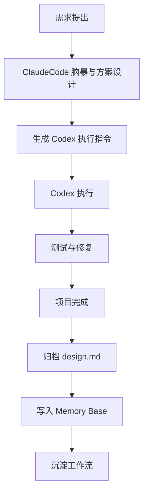

# 项目归档模板

> **用途**: 项目完成后的归档总结。复制此模板，填入真实内容。
>
> **触发条件**: 用户说"项目完成/归档/结束/总结"时使用。
>
> **文件命名**: `YYYY-MM-DD 项目名称 归档总结.md`，放入 `04_归档项目/{类型}/` 目录下。

---

# YYYY-MM-DD 项目名称 项目归档

## 1. 项目基本信息

- 项目名称：
- 所属领域：交易 / 副业 / 学校
- 项目类型：WebApp / App / Skill / 嵌入式开发 / 机器学习
- 开始日期：
- 完成日期：
- 执行 Agent：ClaudeCode / Codex / 双Agent
- 项目路径：
- 归档路径：

---

## 2. 项目目标

<!-- 项目最初的目标是什么 -->

---

## 3. 实际完成内容

<!-- 只写真实完成的内容，不能捏造 -->

1.
2.
3.

---

## 4. 未完成内容

<!-- 诚实记录未完成的部分 -->

1.
2.

---

## 5. ClaudeCode 执行记录摘要

<!-- ClaudeCode 在本项目中承担了什么，做了什么关键决策 -->

| 日期 | 任务 | 产出 | 备注 |
|---|---|---|---|

---

## 6. Codex 执行记录摘要

<!-- Codex 在本项目中执行了什么，写了哪些代码 -->

| 日期 | 任务 | 产出 | 备注 |
|---|---|---|---|

---

## 7. 技术方案

<!-- 项目采用的技术架构和关键选型 -->

- 技术栈：
- 架构：
- 关键依赖：
- 部署方式：

---

## 8. 文件产物

<!-- 项目产生的所有重要文件 -->

| 文件 | 路径 | 说明 |
|---|---|---|

---

## 9. design.md 归档情况

- 是否存在 design.md：是 / 否
- 原路径：
- 归档路径：
- 如果不存在，说明：<!-- 如实说明原因 -->

---

## 10. 项目流程图

---

## 11. Done Criteria 检查

<!-- 复制对应项目类型的 Done Criteria 并逐项勾选 -->

- [ ] 项目目标已明确
- [ ] 核心任务已完成
- [ ] 关键文件已生成或更新
- [ ] 测试或人工验证已完成
- [ ] 项目记录已更新
- [ ] NEXT_ACTIONS 已清理或转入后续计划
- [ ] design.md 已检查
- [ ] Skill 产物已归类
- [ ] 回滚点已记录
- [ ] 工作流沉淀已更新
- [ ] 项目总索引已更新

---

## 12. 问题与解决方案

| 问题 | 原因 | 解决方案 | 可复用经验 |
|---|---|---|---|

---

## 13. 回滚点

<!-- 列出本项目所有关键回滚点 -->

| 日期 | 回滚点名称 | 涉及文件 | 说明 |
|---|---|---|---|

---

## 14. 可复用工作流

<!-- 从本项目提取的可复用工作流，将写入 02_工作流沉淀/ -->

1.
2.

---

## 15. 后续优化方向

<!-- 如果有更多时间，还可以做什么 -->

1.
2.

---

*模板创建日期：2026-06-10 | 执行 Agent：ClaudeCode*
